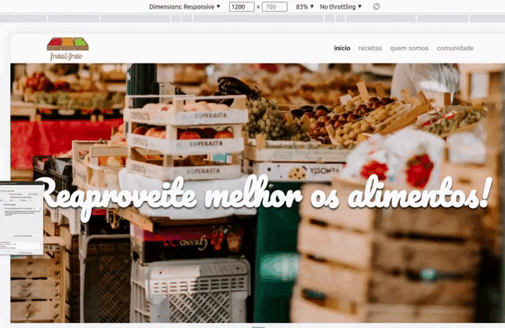

# Fruto e Fruta - HTML/CSS

## Sobre:

Aplicação desenvolvida para aperfeiçoar os conhecimentos em CSS, onde existe a necessidade de colocar pastas para cada classe css (em sua necessidade).

## Layout:



## Como executar o projeto?

The steps to access the project are very simple, but follow in the following order:

```bash
# Terminal

git clone https://github.com/MateusMaciel340/fruta-fruto-html-css # clone do repositório

cd fruta-fruto-html-css/ # acessando pasta

# acessar Live Server com index.html
```


## Tecnologias

As seguintes ferramentas foram utilizadas na construção do projeto:

### Frontend

- HTML
- CSS

## Contribuidores

<table>
    <thead>
        <tr>
            <td>
                
            </td>
        </tr>
    </thead>
    <tbody>
        <tr>
            <th>Mateus Maciel</th>
        </tr>
    </tbody>
</table>

## How to contribute?

1. Fork o projeto.
2. Crie uma nova ramificação com suas alterações: `git checkout -b my-feature`
3. Salve as alterações e crie uma mensagem de confirmação contando o que você fez: `git commit -m Modifying this [...]`
4. Envie suas alterações: `git push origin my-feature`

## Licença

Este projeto é licenciado sob a licença Alura Cursos.